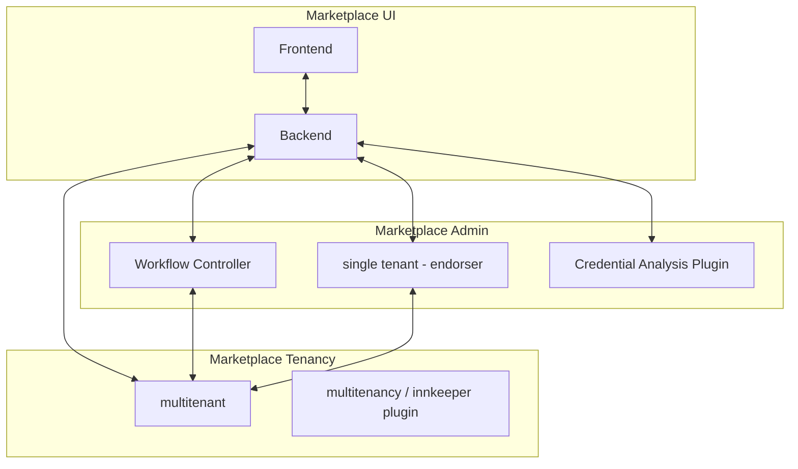
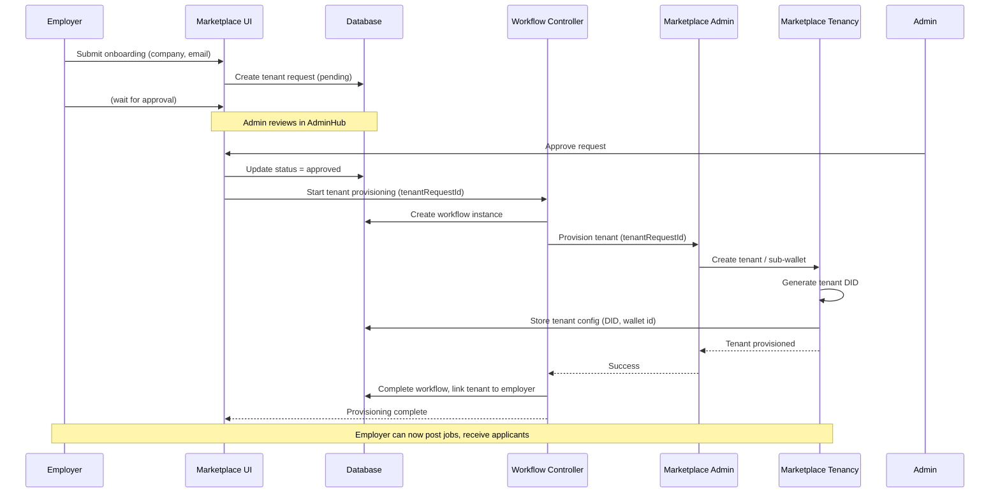
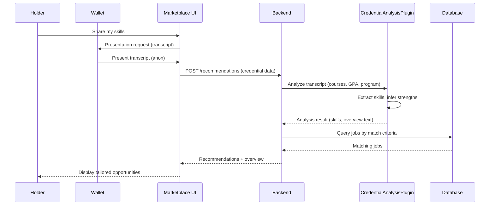

# Marketplace Architecture: Administration & Employer Tenant Onboarding

## System Overview

This document describes the architecture for the Apply Utopia marketplace, focusing on administration and employer tenant onboarding flows.

---

## Architecture Diagram



---

## Component Responsibilities

| Component | Role |
|-----------|------|
| **Marketplace UI (Frontend)** | Vue 3 PWA: discovery, transcript sharing, employer onboarding form, admin hub |
| **Marketplace UI (Backend)** | Express API: config, credentials, recommendations, tenant request CRUD |
| **Workflow Controller** | Orchestrates multi-step workflows: tenant provisioning, agent coordination, retries, state transitions |
| **Backend Database** | Stores tenant requests, jobs, employer config, workflow state |
| **Marketplace Admin** | Single-tenant ACA-Py: platform admin identity, tenant approval operations |
| **Marketplace Tenancy** | Multitenant ACA-Py: one sub-wallet per employer; handles tenant DIDs, credential issuance |
| **Credential Analysis Plugin** | Analyzes transcript credentials: extracts skills, courses, GPA; generates overview text; matches to job criteria |
| **DigiCred Mobile Wallet** | Holder wallet: stores credentials, responds to presentation requests for transcript sharing |

---

## Tenant Onboarding Flow (Sequence)



---

## Transcript / Credential Analysis Flow



---

## Data Flow Summary

```
┌─────────────────────────────────────────────────────────────────────────┐
│                        TENANT ONBOARDING FLOW                            │
├─────────────────────────────────────────────────────────────────────────┤
│                                                                         │
│  Employer ──► Marketplace UI ──► Database (tenant_requests)            │
│       │              │                    │                             │
│       │              │                    └── pending                  │
│       │              │                                                    │
│       │              ▼                                                    │
│       │       Admin Hub (Admin reviews)                                   │
│       │              │                                                    │
│       │              ▼                                                    │
│       │       Approve ──► Workflow Controller                             │
│       │                         │                                          │
│       │                         ├──► Marketplace Admin ──► Marketplace Tenancy │
│       │                         │         │              │                │
│       │                         │         │              └── sub-wallet    │
│       │                         │         │              └── Tenant DID   │
│       │                         │         │                                │
│       │                         └──► Database (workflow state, tenants)   │
│       │                                                                   │
└─────────────────────────────────────────────────────────────────────────┘

┌─────────────────────────────────────────────────────────────────────────┐
│                     HOLDER / TRANSCRIPT FLOW                             │
├─────────────────────────────────────────────────────────────────────────┤
│                                                                         │
│  Holder ──► DigiCred Wallet (credentials)                                │
│     │                                                                   │
│     └──► Marketplace UI ──► "Share transcript"                          │
│                │                                                        │
│                └──► Presentation request ──► Wallet                      │
│                │         │                                              │
│                │         └──► Holder presents transcript                │
│                │                                                        │
│                └──► Backend ──► Credential Analysis Plugin               │
│                │                    │                                   │
│                │                    └──► Skills, overview, matches      │
│                │                                                        │
│                └──► Backend ──► Recommendations (matched jobs)         │
│                                                                         │
└─────────────────────────────────────────────────────────────────────────┘
```

---

## Proposed Database Schema (Tenant Onboarding)

```sql
-- Tenant onboarding requests (from EmployerOnboard form)
CREATE TABLE tenant_requests (
  id UUID PRIMARY KEY,
  tenant_type VARCHAR(50),      -- Employer | Scholarship Admin | Education Institution
  name VARCHAR(255),
  email VARCHAR(255),
  company_name VARCHAR(255),
  industry VARCHAR(100),
  submitted_at TIMESTAMPTZ,
  status VARCHAR(20),           -- pending | approved | rejected
  reviewed_at TIMESTAMPTZ,
  reviewed_by VARCHAR(255)
);

-- Provisioned tenants (after Marketplace Admin + Marketplace Tenancy)
CREATE TABLE tenants (
  id UUID PRIMARY KEY,
  tenant_request_id UUID REFERENCES tenant_requests(id),
  did VARCHAR(255),             -- Tenant DID from Tenancy Agent
  wallet_id VARCHAR(255),       -- Sub-wallet identifier
  created_at TIMESTAMPTZ
);

-- Employer config (jobs, etc.) linked to tenant
CREATE TABLE employers (
  id UUID PRIMARY KEY,
  tenant_id UUID REFERENCES tenants(id),
  name VARCHAR(255),
  logo_url VARCHAR(500),
  -- ...
);

-- Workflow instances (Workflow Controller state)
CREATE TABLE workflow_instances (
  id UUID PRIMARY KEY,
  tenant_request_id UUID REFERENCES tenant_requests(id),
  workflow_type VARCHAR(50),     -- e.g. 'tenant_provisioning'
  status VARCHAR(20),             -- running | completed | failed
  current_step VARCHAR(100),
  payload JSONB,
  started_at TIMESTAMPTZ,
  completed_at TIMESTAMPTZ,
  error_message TEXT
);
```

---

## Open Questions / Next Steps

1. **Workflow Controller**: Temporal, Camunda, custom state machine, or event-driven (e.g. Redis + workers)?
2. **Marketplace Admin ↔ Marketplace Tenancy**: REST, internal queue, or direct ACA-Py admin API?
3. **Wallet connectivity**: How does Marketplace UI connect to Marketplace Admin/Tenancy? (HTTP, WebSocket, mediator?)
4. **Holder ↔ Employer**: After tenant provisioning, how do applicants connect? OOB invitation from employer?
5. **Credential issuance**: Does Tenancy Agent issue employer credentials to the wallet, or is that separate?
6. **Credential Analysis Plugin**: ACA-Py plugin (runs in agent) vs standalone microservice? AI/LLM for overview text?

